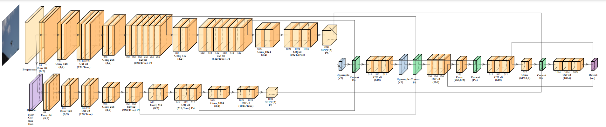

# STMOFlow
## About STMOFlow

STMOFlow is an official implementation of the techniques described in the paper **"STMOFlow: A Spatiotemporal Framework for Real-Time Small Object Detection."**




### Model Overview

The core detection model leverages a two-stream architecture that integrates temporal context in two ways: one stream processes a stack of consecutive frames to extract robust spatial features, while the other computes optical flow to explicitly capture motion dynamics. This dual-path approach enables the detection model to pick up even the tiniest objects by exploiting subtle temporal cues.

### Tracking Integration

Although the detection model is highly sensitive to small objects thanks to its temporal cue integration, it tends to produce a number of false positives. To address this, the framework incorporates a robust tracking module that serves as a filter. The tracker computes the Intersection over Union (IoU) between detection boxes and tracker boxes, and only detections that exceed a low IoU threshold—thus demonstrating temporal consistency—are retained. In situations where the detection model's outputs are inconsistent or incomplete, the tracker’s reliable predictions act as a fallback, substantially minimizing false positives and refining overall detection performance.

_Framework with tracking can be used with a different detection model as well_

## Demo Videos

The videos below showcase the difference between the plain detection model and the enhanced framework that includes filtering via tracking. In the first video, you can see the raw detections produced by the model using temporal cues, which, while sensitive to tiny objects, also yield several false positives. The second video demonstrates how the tracking module refines these detections by filtering out inconsistent results, leading to more accurate and reliable outputs.

- **Video 1: Plain Detections**  
  This video illustrates the detections obtained directly from the model without any filtering.

- **Video 2: Filtered Detections**  
  This video shows the detections after applying the tracking-based filtering, which significantly reduces false positives.

*Replace the placeholder links below with your actual video URLs or file paths:*

https://github.com/user-attachments/assets/242533f8-f957-424b-8490-36b59c9a694f


https://github.com/user-attachments/assets/f57f58c9-228d-45e7-8896-abc42907eaac


# STMOFlow Installation Guide
This guide will walk you through setting up the STMOFlow project locally. It includes instructions on forking the repository, cloning it, creating a Conda environment, activating it, and installing the necessary dependencies.

## Fork the Repository
- Fork the Repository
- Clone Your Repository:
```
git clone https://github.com/your-username/STMOFlow.git
```
- Navigate into the Repository:
```
cd STMOFlow
```

## Set Up Your Conda Environment
- Create a Conda Environment
```
conda create -n STMOFlow python=3.12.4
```
- Activate the Environment
```
conda activate STMOFlow
```

## Install the Project Dependencies
```
pip install -r requirements.txt
```

# Detect In a Local Video

This section explains how to run the inference scripts for both plain detection and detection with tracking. Both scripts process a local video file and optionally save the results to a file when the `--save` flag is used.


## Plain Detection

The plain detection script uses a sliding window to merge consecutive video frames and performs YOLO detection on the merged frame. It then displays the detection results in a window and, if enabled, writes the detection details to a text file.

```
   python plain_detection.py path/to/your/video.mp4
```

## Detection with Tracking

The detection with tracking script integrates YOLO detection with DeepSORT tracking. In addition to running detection, it uses a tracker to maintain object identities across frames. The script visualizes:

- Green Boxes: YOLO detections.
- Red Boxes: Tracker outputs.
- Blue Boxes: Final detection boxes (after filtering based on IoU with tracker boxes).

```
python detection_with_tracking.py path/to/your/video.mp4
```

If you want to save the detections, you may run:
```
python detection_with_tracking.py path/to/your/video.mp4 --save
```


