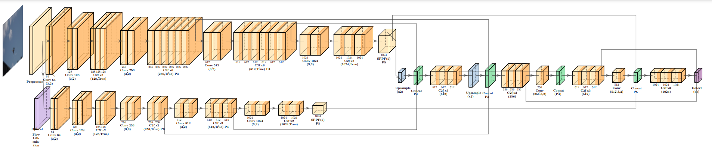

# STMOFlow

[](https://colab.research.google.com/drive/1jq1W2KXS2nk8yEwnYuxwv9eWyLnloNaF?usp=sharing)

---

## Table of Contents

* [About STMOFlow](#about-stmoflow)

  * [Model Overview](#model-overview)
  * [Tracking Integration](#tracking-integration)
* [Hosted API Demo](#hosted-api-demo)

  * [Quick Test (cURL)](#quick-test-curl)
  * [Interactive Docs](#interactive-docs)
* [Demo Videos](#demo-videos)

  * [Video 1: Plain Detections](#video-1-plain-detections)
  * [Video 2: Filtered Detections](#video-2-filtered-detections)
* [STMOFlow Installation Guide](#stmoflow-installation-guide)

  * [Fork the Repository](#fork-the-repository)
  * [Clone Your Repository](#clone-your-repository)
  * [Set Up Your Conda Environment](#set-up-your-conda-environment)
  * [Install the Project Dependencies](#install-the-project-dependencies)
* [Detect In a Local Video](#detect-in-a-local-video)

  * [Plain Detection](#plain-detection)
  * [Detection with Tracking](#detection-with-tracking)

---

## About STMOFlow

STMOFlow is the official implementation of the techniques described in the paper **"STMOFlow: A Spatiotemporal Framework for Real‑Time Small Object Detection."**
It combines temporal context (multi‑frame stacks and optical flow) with YOLOv8 to detect tiny objects and integrates **DeepSORT** tracking to prune false positives.



### Model Overview

The detection backbone has two streams:

1. **Spatial stream** – stacks consecutive RGB frames to extract robust spatial features.
2. **Temporal stream** – computes optical‑flow maps to capture motion dynamics.

Fusing the two yields high recall on very small objects.

### Tracking Integration

Detections are passed to a **DeepSORT** tracker.  Boxes that keep a consistent IoU with tracker hypotheses are retained; the rest are dropped.  This simple filter slashes false positives and provides stable IDs across frames.

> *The same filtering layer can be used with any detection model.*

---

## Hosted API Demo

Spin‑up is optional!  A fully‑hosted REST API is live so you can try the model without cloning anything.

### Quick Test (cURL)

```bash
curl -X POST "http://13.60.254.110/detect/?return_video=true" \
  -F "file=@your_video.mp4" \
  --output annotated.mp4
```

| Parameter      | Description                                             |
| -------------- | ------------------------------------------------------- |
| `file`         | Video to annotate (MP4/AVI/MOV/MKV).                    |
| `return_video` | When `true`, the server streams back the annotated MP4. |

The command uploads `your_video.mp4`, runs detection + tracking, and downloads **`annotated.mp4`** with coloured overlays and ID labels.

### Interactive Docs

API reference and an in‑browser tester are auto‑generated by FastAPI:
👉 **[http://13.60.254.110/docs](http://13.60.254.110/docs)**

Use the file‑picker there if you prefer a GUI instead of cURL.

---

## Demo Videos

Below are two side‑by‑side examples showing the benefit of the tracking filter.

* **Video 1: Plain Detections** – raw YOLO detections on stacked frames.
* **Video 2: Filtered Detections** – same clip after DeepSORT pruning.

[https://github.com/user-attachments/assets/242533f8-f957-424b-8490-36b59c9a694f](https://github.com/user-attachments/assets/242533f8-f957-424b-8490-36b59c9a694f)

[https://github.com/user-attachments/assets/f57f58c9-228d-45e7-8896-abc42907eaac](https://github.com/user-attachments/assets/f57f58c9-228d-45e7-8896-abc42907eaac)

---

# STMOFlow Installation Guide

> Skip this section if you only want to hit the hosted API.  The steps below are for running the pipeline **locally**.

## Fork the Repository

1. Click **Fork** on GitHub.
2. Clone *your* copy:

```bash
git clone https://github.com/KomisD/STMOFlow.git
cd STMOFlow
```

## Set Up Your Conda Environment

```bash
conda create -n STMOFlow python=3.12.4
conda activate STMOFlow
```

## Install the Project Dependencies

```bash
pip install -r requirements.txt
```

---

# Detect In a Local Video

Run either of the scripts below on a local file.  Add `--save` to write outputs.

## Plain Detection

```bash
python plain_detection.py path/to/your/video.mp4
```

## Detection with Tracking

```bash
python detection_with_tracking.py path/to/your/video.mp4 [--save]
```

* **Green boxes** – YOLO detections
* **Red boxes** – DeepSORT tracker
* **Blue boxes** – Final detections after IoU filtering

---

> **License:** MIT
> **Contact:** \<[komdimos@gmail.com](mailto:komdimos@gmail.com)>
